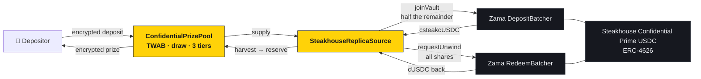
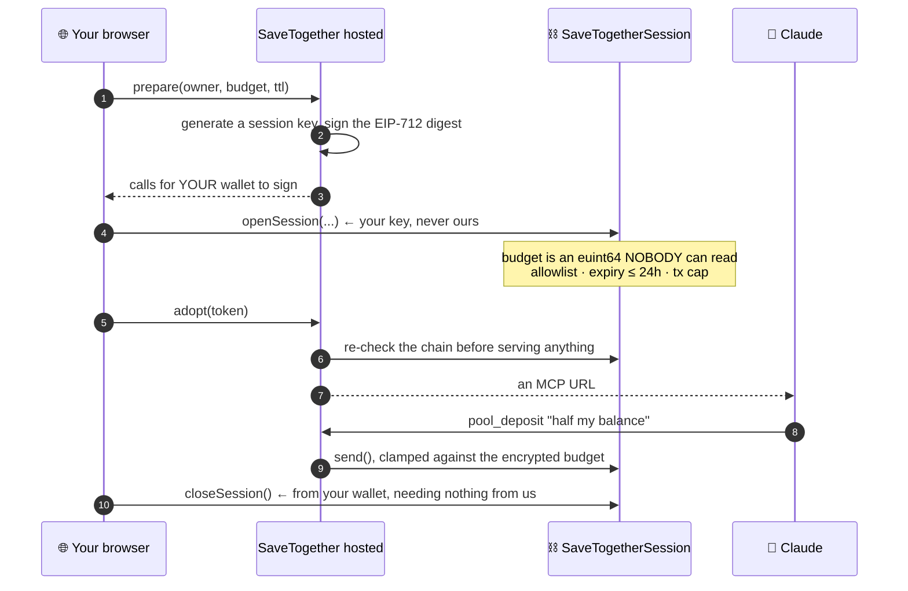
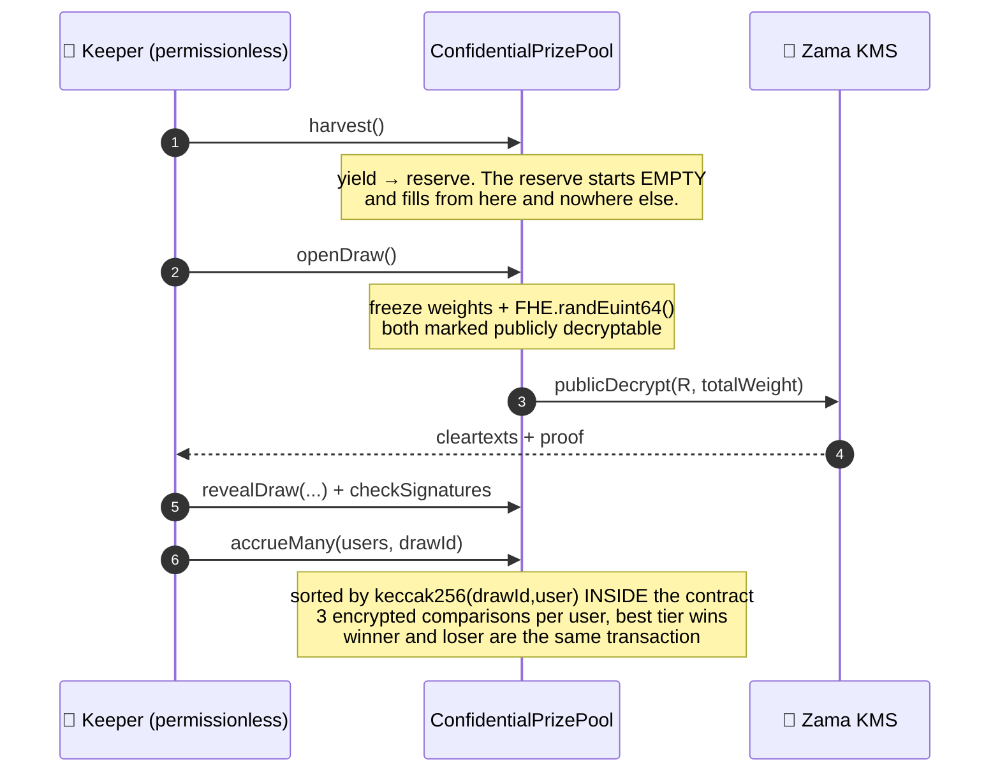

<div align="center">

# 🎟 SaveTogether

### No-loss prize savings where your balance, your odds, and whether you won all stay encrypted

**Deposit confidential USDC. Your principal is never at risk — only the yield becomes a prize.
Every round a winner is drawn, weighted by how much you held and for how long, and nobody can
see your balance, your odds, or your result. Not other depositors. Not the keeper. Not the pool.**

<br/>

[](https://docs.zama.org/protocol)
[](https://sepolia.etherscan.io/)
[](https://soliditylang.org/)
[](https://www.zama.org/)

[](https://ghostpool-himess.vercel.app)
[](#-deployed-sepolia)
[](#-testing)
[](https://app.zama.org/earn)
[](./LICENSE)

**[🌐 Live app](https://ghostpool-himess.vercel.app) · [💬 Talk to it](#-talking-to-it) · [📜 Contracts](#-deployed-sepolia) · [🧠 How the draw works](#-the-idea-and-the-one-thing-that-makes-it-hard)**

</div>

---

## 💡 Why

**Zama and Steakhouse × Morpho already shipped the supply side.** `app.zama.org`
runs a confidential vault — Steakhouse Confidential Prime USDC, **7.20% APY,
$40.5M deposited** — where you shield your deposit and earn encrypted yield in
batches.

You can hide what you save. **You still cannot hide what you win.**

> Every prize-savings protocol broadcasts it. PoolTogether's TWAB is public, so
> your balance, your odds and your result are readable by anyone with an RPC
> endpoint. SaveTogether is that product with the broadcast removed — and it
> settles in the same cUSDC and earns through the same vault.

---

## 📖 Contents

- [Why](#-why)
- [Deployed (Sepolia)](#-deployed-sepolia)
- [Composed with Zama's vault, both directions](#-composed-with-zamas-vault-both-directions)
- [Talking to it](#-talking-to-it)
- [Try it in thirty seconds](#-try-it-in-thirty-seconds)
- [The idea, and the one thing that makes it hard](#-the-idea-and-the-one-thing-that-makes-it-hard)
- [Prize tiers, derived rather than chosen](#-prize-tiers-derived-rather-than-chosen)
- [Anyone can audit the draw](#-anyone-can-audit-the-draw)
- [Claiming announces nothing](#-claiming-announces-nothing)
- [Where the prize comes from](#-where-the-prize-comes-from)
- [What we measured](#-what-we-measured)
- [Testing](#-testing)
- [What is hidden, and what is not](#-what-is-hidden-and-what-is-not)
- [Running it](#-running-it)
- [What is not done](#-what-is-not-done)

---

## 📜 Deployed (Sepolia)

> Chain `11155111` · **all three of our contracts Etherscan-verified** ✅ ·
> `npm run verify:all` reproduces it from `out/deployment.json`

### Ours

| Contract | Address | Purpose |
|---|---|---|
| **ConfidentialPrizePool** | [`0xa9B69D…6631`](https://sepolia.etherscan.io/address/0xa9B69Dc9F9f4C4512c926ba9eA432eBcF0026631#code) | TWAB, the draw, three encrypted prize tiers |
| **SteakhouseReplicaSource** | [`0xDa596e…3695`](https://sepolia.etherscan.io/address/0xDa596e47029839eA7E1990f97F106fd6d2e33695#code) | the yield, and both directions into Zama's vault |
| **SaveTogetherSession** | [`0xE5c667…6Cf6`](https://sepolia.etherscan.io/address/0xE5c667c0C58242f89ee59f9269111A3EfB836Cf6#code) | encrypted, on-chain-bounded session budgets |

### Zama's, which we call and never deploy

| Contract | Address | |
|---|---|---|
| cUSDC | [`0x7c5BF4…3639`](https://sepolia.etherscan.io/address/0x7c5BF43B851c1dff1a4feE8dB225b87f2C223639) | what the pool settles in |
| Deposit batcher | [`0x487585…F53b`](https://sepolia.etherscan.io/address/0x48758559c14d4d92b4C74A99660B6a8dbe85F53b) | cUSDC → shares · our principal is in [batch 286](https://sepolia.etherscan.io/address/0xDa596e47029839eA7E1990f97F106fd6d2e33695) |
| Redeem batcher | [`0xe94E9a…BEb0`](https://sepolia.etherscan.io/address/0xe94E9afdDd43a19C2914739e9279cb6Fe287BEb0) | shares → cUSDC, the way back out |
| csteakcUSDC | [`0x13F7d3…28c4`](https://sepolia.etherscan.io/address/0x13F7d34A4f0102734F19E3Ff16e068Fe194B28c4) | the vault share |
| Steakhouse Confidential Prime USDC | [`0x6AB549…864C`](https://sepolia.etherscan.io/address/0x6AB54988261AEC573a2CA13cF802d3B1114f864C) | the ERC-4626 both batchers settle against |

---

## 🔗 Composed with Zama's vault, both directions



**The honest split, and both halves are on screen wherever they are shown:**

| | |
|---|---|
| **The vault composition** | **Real.** Zama's deployed batchers, real shares, on chain, both directions. |
| **The rate** | **Ours.** Zama's Sepolia vault is idle-only with no yield adapter — measured — so nothing about it appreciates and a prize funded from its appreciation would never be paid. |

The mainnet vault is Steakhouse × Morpho and we do not touch it. Zama's Sepolia
deployment is their own replica of it — the ERC-4626 is literally named
*Steakhouse Confidential Prime USDC* — and that is what we join.


---

## 💬 Talking to it

The pool has a second front door: you can just say what you want.

```
you    open a session with a 500 cUSDC budget
you    what's the draw status?
you    put half my balance in the pool
```

Connect a wallet, sign once, paste a URL into Claude's connector settings. No
terminal, no npm, no tab kept open.

### The key we hold cannot do more than the chain lets it



A server holds a session key. That is worth being precise about rather than
reassuring about, because "we store your key safely" is the sentence every
custodial product says right before it turns out not to be true.

We are not asking you to trust the storage. **Your wallet key never leaves your
browser** — the server has never held one and has no code path that accepts one.
What it holds is a session key whose authority is bounded on chain:

- every spend is clamped against an `euint64` **nobody can read**, including us
- an allowlist bounds where value can go
- an expiry bounds how long, capped at 24 hours
- **you close it from your own wallet**, needing nothing from us

The nearest thing to this in production is MoonPay's PayBox, which reaches a
comparable experience with MPC key shares in hardware enclaves plus a passkey,
built on a company acquired for roughly $100M. Their limits are enforced by their
policy layer — code they run, that you cannot inspect while it runs. Ours are
enforced by a contract, and **the limit itself is encrypted**: the clamp is
measured across 306 live samples with an identical operation sequence and
identical HCU whether a spend fits, exceeds the budget, or exceeds the balance.

And the part that is not reassuring: **a compromised server can spend up to the
remaining budget, to the addresses already on your allowlist, until you revoke.**
It cannot exceed the budget, cannot send anywhere else, cannot extend its own
expiry, and cannot touch anything outside the session. That is the bound. It is
not zero.

### What the server sees

It encrypts the amounts, so it sees them. Two cases, and they are not the same:

- **"deposit 200"** — you typed it, the model already has it, the server learning
  it adds no reader.
- **"deposit half my balance"** — a real loss. The server reads your balance to
  halve it. The reference mechanism still keeps the figure from the *model*; it
  does not keep it from *us*.

We asked whether that could be removed — whether the arithmetic could happen on
chain so no plaintext exists anywhere — and measured the answer. It can, it is
even cheaper, and it is **worse**: doing it publishes the *ratio*, which composes
with the public wrap into an exact amount, forever. The measurements are in
[`docs/spike-plaintext-removal-RESULT.md`](docs/spike-plaintext-removal-RESULT.md)
and the full disclosure table is in
[`docs/session-leakage.md`](docs/session-leakage.md) §6.

### The local install still works, and that is the point

```
savetogether init --rpc <url>
savetogether console
```

Same contracts, same SDK, same tools. Running it yourself is the fallback when
hosting is down — and more usefully, it is the reason the claims above are
checkable instead of promised. The server is not load-bearing, and you can prove
that by not using it.

---

## ⚡ Try it in thirty seconds

1. Connect a wallet on Sepolia.
2. Press **Get 1,000** — the demo token has a public `mint`, so you fund yourself.
3. Press **Authorise**, then **Deposit**.
4. Press **Decrypt my balances** and sign once. Your position is readable by you and
   by nobody else.

### About the demo token

**The pool takes any ERC-7984 token.** The one deployed here is our own mock,
chosen so a first-time visitor can fund themselves in a single click.

The production path is Zama's deployed cUSDC
(`0x7c5BF43B851c1dff1a4feE8dB225b87f2C223639`, with its underlying at
`0x9b5Cd13b8eFbB58Dc25A05CF411D8056058aDFfF`), and both addresses are wired into
`frontend/lib/addresses.ts`. That path needs mint, approve and wrap before anything
happens — and we measured what it does when a precondition is missing: a bare
`execution reverted` with no reason attached. That is a poor first thirty seconds,
so it is not what the demo puts in front of you. The deposit screen supports it.

---

## 🧠 The idea, and the one thing that makes it hard

A prize pool needs to pick a winner in proportion to each participant's weight.
With encrypted balances, the obvious construction — accumulate a running total,
find which range the random number lands in — needs a global ordering over
ciphertexts, and it does not survive people withdrawing mid-period.

**PoolTogether V5 does not do that, and never did.** Its `TierCalculationLib` gives
each user an independent pseudo-random number from `keccak256(drawId, vault, user,
…, winningRandomNumber)`, maps it uniformly into `[0, totalSupply)`, and compares
it against a zone scaled by that user's own time-weighted balance. Every user is
evaluated alone. There is no cross-user aggregation anywhere in the check.

That structure ports to FHE almost unchanged:

```solidity
threshold_i = uniform(keccak256(R, drawId, user), totalWeight)   // plaintext, public
isWinner_i  = FHE.gt(E(twab_i), threshold_i)                     // encrypted weight
credit_i    = FHE.select(isWinner_i, prize, 0)                   // encrypted result
```

`P(user i wins) = twab_i / totalWeight`, exactly the weighting the design calls for,
with one expected winner per draw. No prefix sums, no global ordering, no chunked
draw. The draw transaction is one call to `FHE.randEuint64()` and a KMS reveal —
**nothing per participant**.

---

## 🎚 Prize tiers, derived rather than chosen

Three tiers, PoolTogether's structure: one grand prize, a middle one, and an
ordinary one every round.

| tier | prize | k | expected frequency | at a 30-minute cadence |
|---|---|---|---|---|
| **Grand** | 25 cUSDC | 100 | 1 winner per 100 draws | ~every 2 days |
| **Middle** | 5 cUSDC | 10 | 1 winner per 10 draws | ~every 5 hours |
| **Ordinary** | 1 cUSDC | 1 | 1 winner per draw | ~every 30 minutes |

```
threshold(t) = uniform(keccak(r, drawId, user, t), totalWeight × k[t])
P(win tier t) = weight / (totalWeight × k[t])
```

Sum that over every participant and the weights collapse into `totalWeight`:

> **E[winners of tier t per draw] = 1 / k[t]**, independent of how the balances
> are distributed. `k` is not a tuning knob — it is literally *one winner every
> k draws*, and the schedule does not move when a whale arrives or leaves.

Confirmed on chain: a sole holder's odds print as **1.000% / 10.000% / 100.000%**.

### The sizes come out of the harvest

**Solvency is not the binding constraint — variance is.** A single reserve sized
by the *average* payout still has to absorb a prize that fires once every hundred
draws, and `FHESafeMath.tryDecrease` declining is indistinguishable from losing.

The configuration that *looks* right — a 100 cUSDC grand prize using 57% of the
harvest — measures a **30.2%** chance of a silent zero. What shipped measures
**3.2–3.6%**, and the low utilisation is the variance buffer rather than slack.
20,000 simulated trials, in [`spikes/y2-reserve-simulation.ts`](spikes/y2-reserve-simulation.ts);
the full derivation is [`docs/tier-derivation.md`](docs/tier-derivation.md).

**And the tier you won is itself encrypted** — one `euint64` credit whatever
happened. In PoolTogether your tier is public the moment a claim lands.

---

## 🔍 Anyone can audit the draw

`r` and `totalWeight` are published at every reveal, so every threshold is a
pure function of public inputs and the whole draw can be recomputed by a stranger.

```bash
npx hardhat run scripts/verify-draw.ts --network sepolia
```

```
draw 2 of 2   r 8026672892836444255   total 22344000000000
1. every threshold recomputed from public inputs, checked against the contract
   0xF505…E5Ae   t0 20.14%   t1 40.61%   t2 63.31%
   0x4446…b5eC   t0 78.83%   t1 73.57%   t2 92.58%
   6/6 thresholds reproduce exactly
3. my own outcome, which only I can check
   tier 2 CLEARED  (odds 99.248%)  →  rule says WIN tier 2, 1 cUSDC
```

**Be precise about the scope, because overstating it would be worse than not
having it:**

| | |
|---|---|
| Anyone, with no permissions | every threshold, and that the sampling is unbiased rather than a bare modulus |
| A participant, for themselves | their own weight against their own thresholds, and therefore their own result |
| **Nobody** | **anyone else's result** — weights are encrypted, which is the product |

This is why the aggregate stays public. Encrypting `totalWeight` was designed,
measured at **8.3×** and a 40% cut in keeper throughput, and rejected — it would
hide a number that a one-wei deposit recovers anyway, at the cost of the only
thing a lottery really has to prove.

---

## 🎁 Claiming announces nothing



The threshold above is a pure function of public inputs, so **a participant can
work out their own result off chain with no transaction at all.** They know their
own deposits and the timestamps are on chain.

A loser therefore has no reason to claim. Under rational behaviour only winners
would, and **"who claimed" would become "who won"** — the leak returns on the
cheapest observation available.

So there is no claim. `accrue(user, drawId)` is permissionless, unconditional and
idempotent, and a keeper runs it for every participant, winner or not. A losing
accrual and a winning one are the same transaction differing only in an encrypted
comparison. The prize compounds straight into the confidential balance, so there is
no separate withdrawal whose timing could be correlated with a draw.

### What PoolTogether already does here, and where we actually differ

**V5 also has no user-initiated claim.** Third-party `Claimer` bots claim on
winners' behalf for a VRGDA-priced fee, so a V5 depositor never sends a claim
either. Framing "no claim step" as our novelty is too broad, and the accurate
version is sharper:

> They removed the user's **burden**. The claim transaction still names the
> winner. We removed the **signal**: winning and losing are the same transaction.

**What that costs us, measured.** Their claim is `O(winners)` because only winners
are claimed for. Ours is `O(participants)` because everybody must be accrued
whether they won or not: 386,608 gas each, so a hundred participants is 38.7M gas
per draw — over a block. That is the price of the property, and
[`docs/inventory.md`](docs/inventory.md) records the lazy-accrual design that
would fix it.

### We hide amounts, not identities

Every `Deposited` event names its depositor, so **the participant set is public
and anyone can enumerate it.** What is hidden is how much each holds, what their
odds are, and whether they won.

This is worth stating plainly because it is the thing most likely to be assumed.
FHE is not a mixer. Unlinking a deposit from an address is a zero-knowledge
property and would need a shielded pool underneath this one, which is a different
protocol rather than a setting.

### Deposit caps would be *harder* here, not easier

V3's real failure was the whale — odds track balance, so a large enough depositor
wins constantly — and V4 answered with per-wallet deposit caps and a prize cap.
Under FHE a cap is enforceable on an encrypted balance without revealing it, which
sounds like an improvement and is a trap:

- a cap is defeated by splitting across wallets, in **any** system, because Sybil
  resistance needs identity and FHE does not provide it; and
- in V4 the community could *see* a whale splitting. Here nobody can.

So the honest position is that our privacy property makes this problem worse, and
a cap we shipped would bind less than PoolTogether's does. It is not in the
contract for that reason.

---

### If you are the only depositor, you win the ordinary tier every round

Worth saying before it is noticed, because it looks rigged and is not. The
threshold is drawn uniformly from [0, totalWeight), and a lone holder's weight IS
the total — so it is always above their threshold. That is the weighted draw
being correct: they hold all of the weight. Odds only start meaning anything once
somebody else is in.

Making a sole participant lose would be the wrong behaviour, not a fix.

## 💰 Where the prize comes from

Yield, on the pool's own deposits. Principal does not sit in the pool — it goes
to a yield source the moment it arrives, and `harvest()` moves what it has earned
into the reserve the prizes are paid from.

### The product this replicates, and what is actually ours

On mainnet, confidential USDC earns in **Steakhouse Confidential Prime**, a
Morpho vault. That vault is mainnet-only. So the shape of it was rebuilt on
Sepolia and the prize pool put on top — which is the whole idea: the earning
product already exists, and this adds *no-loss prize savings* to it.

`SteakhouseReplicaSource` is that replica, and it is deliberately one contract
doing two jobs, because an earlier design split them and had to ship the wrong
half:

| | |
| --- | --- |
| **The vault composition** | **Real.** `joinVault()` sends the pool's principal into Zama's deployed deposit batcher and real shares come back when their keeper dispatches the batch. |
| **The rate** | **Ours.** Zama's Sepolia vault has no yield adapter — measured, not assumed — so nothing about it appreciates. The APY is the replica's, and every screen that shows it says so. |

It is a replica in the same sense GhostLend's was: our contract, our rate,
labelled as a stand-in everywhere it appears. It is **not** the live mainnet
vault and is not affiliated with Steakhouse Financial or Morpho.

### The composition, on chain

The pool's principal is in **batch 286** of Zama's own batcher:

```
tx        0xc3bb31f13aaf629fa37f58958cb2bfc6592152ec748d8e753cb98e0e0d69cb9a
batcher   0x48758559c14d4d92b4C74A99660B6a8dbe85F53b
shares    0x13F7d34A4f0102734F19E3Ff16e068Fe194B28c4   (Confidential steakcUSDC)
```

Re-run it yourself with `npx hardhat run scripts/prove-vault-composition.ts
--network sepolia`.

**The pool settles in cUSDC because of that batcher, not for decoration.** Its
`toToken` is cUSDC — read off the chain — so a pool settling in its own token
could never join a batch, and the composition would be a diagram.

`joinVault()` sends **half** the principal, and both halves of that are
deliberate. Not the whole balance: this contract also holds the pot its yield is
paid from, and joining that would send the prize reserve into the vault and leave
the pool unable to pay anything. Not all the principal either: a batch is a round
trip on somebody else's clock and the source does not unwind shares on demand, so
the rest stays as the withdrawal buffer a real vault keeps, for the same reason.

Two things worth recording because the documentation says otherwise. The
batcher's `toToken` is `Confidential steakcUSDC (Mock)`, not the
`Confidential mvUSDC` that the address reference lists as cShare. And while every
step of a batch is documented as permissionless, our own `dispatchBatchCallback`
reverted — the batch settled because Zama runs a keeper, so there is an
operational dependency the docs do not mention.

## 🔬 What we measured

Everything below is measured on live Sepolia, not inferred. `findings.md` has the
full accounting, including the measurements that came out wrong and why.

| | |
| --- | --- |
| FHE operation sequence, 306 accruals | **1 distinct — identical** |
| HCU, 306 accruals | **1 distinct — 2,023,192** |
| Execution gas | two values, four apart |
| Does that vary with the outcome? | **No** — Welch t = 1.03, df = 4.6, **p = 0.35** |
| Does it vary with the address? | **Yes** — 16% to 58% between addresses |

The address is a public input to the threshold, so gas varying with it discloses
nothing an observer does not already hold.

Getting to that took a correction worth reading: a chi-square over 306 pooled
observations crossed the significance threshold and looked like a real leak. It was
**pseudo-replication** — the samples were nineteen repeated measurements on each of
eight fixed addresses, not 306 independent ones. On the correct unit of analysis
the effect vanishes. `findings.md` §14.

### The rest of the numbers

| | |
| --- | --- |
| `accrue`, steady state | 2,582,192 HCU — 7 participants per transaction |
| One observation | 60,000 gas, 5.7% of a deposit |
| KMS reveal, live | 12.0 seconds |
| Local tests | 30 passing |

---

## ✅ Testing

```bash
npm test          # 176 passing
```

| suite | what it pins |
|---|---|
| `withdraw-buffer.ts` | the round trip through Zama's vault, both directions, and that a short buffer loses nothing |
| `reserve-order.ts` | that the keeper cannot choose the winner when the reserve is short |
| `phase-b.ts` | the keeper fee never displaces a prize · a dead keeper cannot brick the pool · ownership can be renounced |
| `c1-indistinguishability.ts` | 312 accruals, 81 winners and 231 losers, **zero within-draw separation** |
| `frozen-surface.ts` | tiers cost +70,867 gas and add **no** outcome-dependence |
| `replica-source.ts` | a paired run where the only difference is the harvest |
| `equality-invariants.ts`, `accrual.ts`, `draw-ordering.ts` | the draw machine itself |
| `mcp.ts`, `mcp-protocol.ts`, `SaveTogetherSession.ts` | the conversational layer and the session module |

Measurement lives separately, in [`spikes/`](spikes/) — 21 standalone
experiments that each answer a question that could have been assumed. The HCU
figures come from decoding `FHEVMExecutor` events and pricing them against
`HCULimit.sol`, not from a table.

---

## 🕶 What is hidden, and what is not

`docs/leakage.md` states three residuals with their bounds rather than claiming
none exist:

1. **Keeper liveness is a privacy property.** If the keeper skips someone, a
   standalone self-accrual is weak evidence they won. Narrowed by draining pending
   credits on every deposit and withdrawal.
2. **The aggregate reveal discloses a winner count, never an identity.**
3. **Deferred compounding puts mild transaction pressure on winners.** The weakest
   of the three: `winningsOf` is EIP-712 readable, so nobody has to transact merely
   to learn they won.

Public by construction: who deposited and when, `totalWeight` and `R` once per
draw, every participant's threshold, and the prize. Individual balances, weights,
outcomes and the reserve stay encrypted.

---

## 💻 Running it

```bash
npm install
npm test                      # 154 tests, local
npx hardhat run scripts/deploy-composed.ts --network sepolia
POOL=0x... npm run keeper     # harvests, reveals draws, accrues everyone

cd frontend && npm install && npm run dev
```

### Two numbers an operator has to know

**Break-even principal.** The reserve fills from `harvest()` and nothing else, so
a prize the reserve cannot cover credits the winner **zero** — and a declined
`tryDecrease` is indistinguishable from losing, by design. That makes underfunding
silent, and this pool ran for hours paying nothing before it was caught.

```
yield = principal × rateBps × elapsed / (10000 × 365 days)
break-even principal = prize × 10000 × 365 days / (rateBps × period)
```

At 1000%/yr, a **300s** round needs **~10,512 cUSDC** of principal behind a 1 cUSDC
prize; a **1800s** round needs **~1,752**. The keeper prints this number every time
it harvests, so the figure that has to be beaten sits next to the round that has to
beat it.

**Principal floor.** Tier and prize sizes are only valid against a stated
principal, because the harvest scales with it. At 12,401 cUSDC held the expected
payout needs **3,066 cUSDC** of principal to break even — **4.0x headroom**. Most
of that principal is the deployer's seed: **withdrawing it during a submission
window would push utilisation up and the reserve warm-up out, silently**, because
a reserve that cannot cover a prize credits the winner zero and a declined
decrease is indistinguishable from losing.

**Warm-up.** The reserve starts empty and fills from harvest alone, so the first
few rounds after a deploy are the only window in which a large prize can fail to
be paid. Simulated over 20,000 trials: **3.2-3.6% chance of one clamp, median at
round 2, p90 at round 4** — after which it is effectively zero. **Deploy, let the
keeper run past round 10, and only then record anything.** Do not pre-fund the
reserve to shorten this; a hand-funded pot is what the paired test in
`test/replica-source.ts` exists to rule out.

**Gas.** A full keeper round — harvest, open, reveal, accrue — is roughly 1.5M gas.
At 2 gwei that is ~0.003 ETH, so a 300-second cadence costs **~0.95 ETH a day** and
a 1800-second cadence **~0.16 ETH**. The deployed keeper runs at 1800s for exactly
this reason. Fund the keeper wallet accordingly: it stops silently when it runs
out, leaving the current draw Open and every later one blocked behind it.

Sepolia credentials go in `probe/secrets.json` (git-ignored) as
`{ "privateKey": "0x…", "sepoliaRpcUrl": "https://…" }`.

| | |
| --- | --- |
| `contracts/ConfidentialPrizePool.sol` | deposits, withdrawals, the TWAB record, the draw, accrual |
| `contracts/mocks/PrizePoolHarness.sol` | test-only: reveals a draw without the KMS |
| `scripts/keeper.ts` | self-healing driver — repairs before it advances |
| `scripts/demo-round.ts` | seeds six participants and runs one full round |
| `test/sepolia-*.ts` | the live measurements |

Built on GhostLend (Season 3, Builder Track second place) — its epoch reveal
machine, its self-healing keeper, and four KMS traps it paid to discover.

---

## 🧭 What is not done

Each of these names the test that pins it, because a limitation nobody can check
is a claim rather than a disclosure.

- **The reserve can still under-pay, and it is silent when it does.** B1 made
  *who* gets paid deterministic; it did not make the reserve infinite. A tier-0 win
  before the reserve can cover it credits the winner zero, and a declined
  `tryDecrease` is exactly what losing looks like. Simulated at **3.2–3.6%**,
  concentrated in the first four rounds after a deploy.
  `test/reserve-order.ts`, `spikes/y2-reserve-simulation.ts`.
- **The first draw after a deploy cannot pay at all.** The source has accrued
  nothing, so the first harvest is zero. Observed live: draw 1 of this pool said
  WIN tier 1 under the public rule and paid nothing. With a sole depositor the
  ordinary tier is won with certainty, so it is **97.3%**, not 3%. Fixed by
  sequencing — the keeper holds the first draw until the source has a full period —
  and not by prize sizing, which cannot touch it.
- **Withdrawal is all-or-nothing.** ERC-7984's transfer clamps to zero rather than
  paying out partially, so asking for more than you hold *or* more than the pool
  has liquid moves **nothing** and the transaction still succeeds. Nothing is
  lost, and a smaller ask goes through. Both causes are now named in the interface
  before the signature. `test/withdraw-buffer.ts`.
- **Accrual is O(participants), where PoolTogether is O(winners).** 386,608 gas
  each, so a hundred depositors is 38.7M gas per draw — over a block. That is the
  price of unconditional accrual, which is the property this design exists for.
  The lazy-accrual design that fixes it is costed but not built.
- **We hide amounts, not identities.** Every `Deposited` event names its
  depositor and the participant set is public. FHE is not a mixer.
- **The prize is a plaintext `uint64`.** PoolTogether's prize *is* the accumulated
  tier liquidity, so a shortfall cannot arise there; ours can. Closing it needs
  `FHE.div` and a rewrite of what `setTiers` means. `docs/tier-derivation.md` §4.
- **`totalWeight` is published.** The aggregate leaks; individual balances do not.
  Kept deliberately: encrypting it costs 8.3× and loses public auditability of the
  draw, which is the thing a lottery most needs to prove. `spikes/a2-encrypted-total.ts`.
- **The keeper is one process with one key.** `cancelDraw` bounds the damage of it
  dying; it does not decentralise it, and `accrueMany`'s fee is a reimbursement
  rather than a market. `test/phase-b.ts`.
- **The replica's yield is pre-funded, not earned.** The 900,000 cUSDC pot is where
  prizes come from; the rate decides how much, the pot decides for how long. Zama's
  Sepolia vault has no yield adapter, so **the composition is real and the
  appreciation is not**.
- **`euint128` for the cumulative accumulator is required, not optional.** A
  6-decimal balance of 1e12 held for a year overflows `2^64` in about seven months,
  and an FHE multiply has no revert to notice it with.
- **No confirmation-depth policy.** Fine on Sepolia; not on mainnet.
