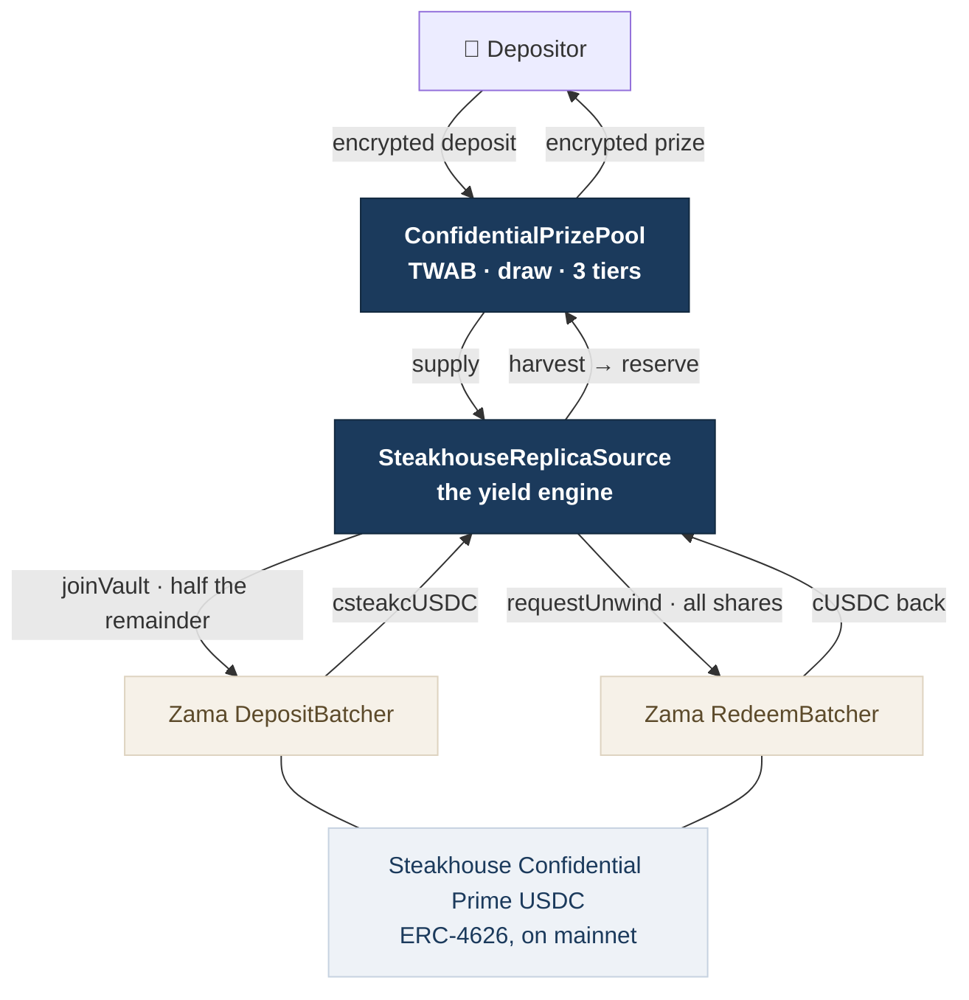
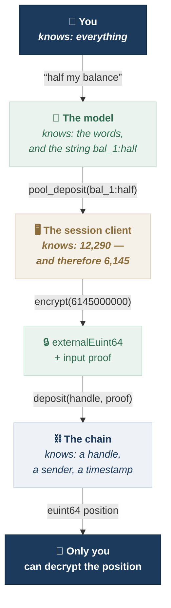
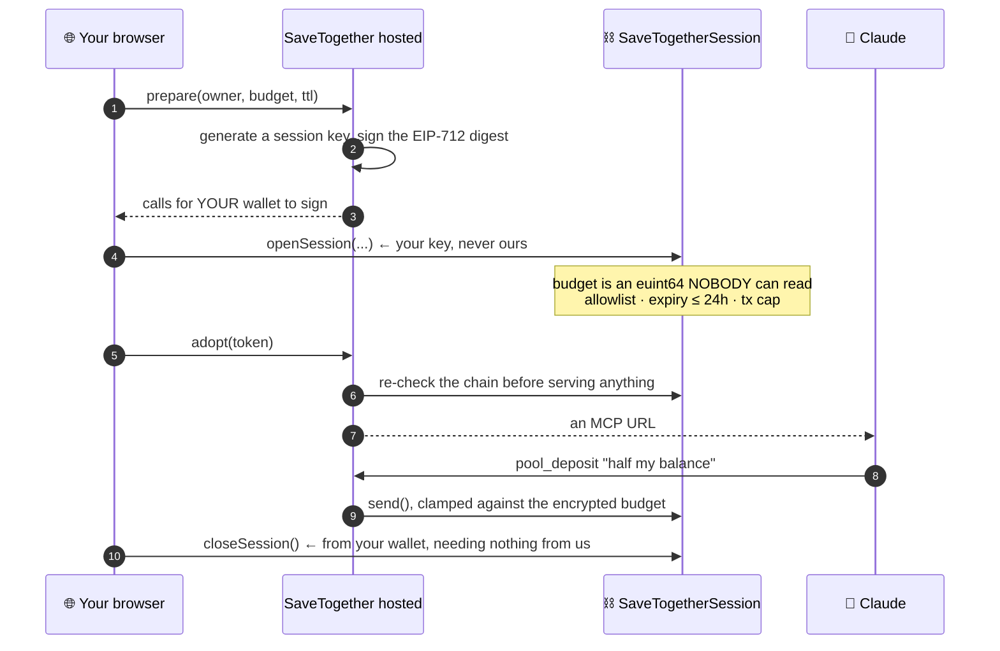
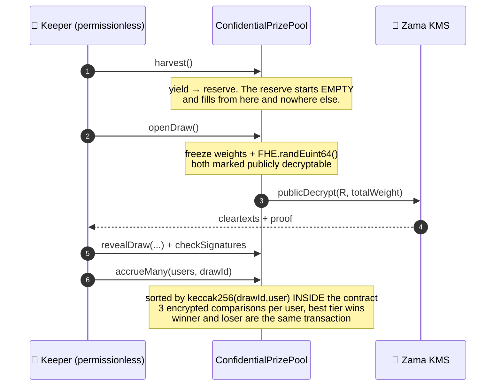

<div align="center">

# 🎟 SaveTogether

### Zama's confidential yield, paid as a prize instead of as interest — with the winner and the odds encrypted too

**Your money stays in Zama's vault, earning exactly as it does today. Instead of taking your
interest in equal shares, you turn it into a chance at all of it. A round you do not win costs
you that round's yield and nothing else — the principal is untouched and withdrawable whenever
you like. And nobody can see your balance, your odds, or your result. Not other depositors. Not
the keeper. Not the pool.**

<br/>

[](https://docs.zama.org/protocol)
[](https://sepolia.etherscan.io/)
[](https://soliditylang.org/)
[](https://www.zama.org/)

[](https://savetogether-fhe.vercel.app)
[](#-deployed-sepolia)
[](#-testing)
[](https://app.zama.org/earn)
[](./LICENSE)

**[🌐 Live app](https://savetogether-fhe.vercel.app) · [💬 Talk to it](#-talking-to-it) · [📜 Contracts](#-deployed-sepolia) · [🧠 How the draw works](#-the-idea-and-the-one-thing-that-makes-it-hard)**

</div>

---

> **On the name.** The project is **SaveTogether**. The app is at
> **[savetogether-fhe.vercel.app](https://savetogether-fhe.vercel.app)** and the deck at
> **[savetogether-deck.vercel.app](https://savetogether-deck.vercel.app)**.
>
> A bare `savetogether.vercel.app` was already taken by someone else, which is why
> there is a suffix at all.
>
> `ghostpool` was its working name and it survives in three places on purpose:
> the Vercel project (whose name Vercel stamps into every per-deployment hostname,
> which a CORS rule matches), the hosted server's path and systemd units on the
> VPS, and the dated reports in `docs/` and `findings.md` that describe what was
> true when they were written. **Those are addresses and records, not branding.**
> Renaming a live address breaks the sessions using it, and rewriting a dated
> report is how a record stops being one.
>
> The old URL still works and is not going away.

## 💡 Why

**Zama shipped confidential yield. We turned that yield into a prize — and hid the
winner and the odds.**

*Who won* is the obvious secret. *What each participant's odds were* is the second one,
and it is a question that **does not exist** when everyone earns pro rata: yield paid in
proportion has no winner, so it creates no "who" to hide. A prize does. That gap is the
whole contribution.

Now the part that qualifies it, which used to come first.

**Zama and Steakhouse × Morpho already shipped the supply side.** `app.zama.org`
runs a confidential vault — Steakhouse Confidential Prime USDC, **7.20% APY,
40,252,088.60 USDC deposited** *(read from `app.zama.org/earn` on 2026-09-04 — it moved
from 7.19% and 40,251,401.78 the day before, so treat every figure here as dated rather
than current)* — where your deposit, your shares and your yield are all encrypted.

That vault already hides everything about your savings: the deposit, the shares and the
yield are all encrypted. **Nothing here improves on that**, and this project would be
dishonest to claim otherwise. The contribution is not that Zama failed to conceal
earnings — it is that turning concealed earnings into a prize creates two new secrets,
and neither survives a public chain.

### What this actually is

Zama's vault puts confidential USDC into Morpho and pays the yield to everyone in
proportion. SaveTogether is **the same money in the same vault with a different
distribution policy**: instead of paying that yield pro rata, it pays all of it to one
or a few participants, chosen by a draw weighted by how much you held and for how long.

| | Zama's vault | SaveTogether |
|---|---|---|
| Where the money goes | Morpho, earning | the same |
| **Who receives the yield** | **everyone, pro rata** | **one or a few, by draw** |
| Principal | always yours | always yours |
| Downside | none | none |

In one sentence: **you keep your money in Zama's vault, and instead of taking your
interest in equal shares, you turn it into a chance at all of it.**

**A loser does not lose.** They forgo that round's yield and nothing else — principal
is untouched, withdrawable at any time, and never at risk. "Received no interest this
round" and "lost money" are different things, and the distance between them is the
entire no-loss claim.

### Three points of composition, not one

- **The same token.** The deposit batcher's `toToken` *is* cUSDC — read off the chain,
  not off a docs page. A pool settling in its own token could never join a batch, and
  the composition would be a diagram rather than a transaction.
- **The same vault.** `joinVault()` goes through Zama's deployed deposit batcher and
  real shares come back. Our principal is in [batch 286](#the-composition-on-chain).
- **The same flow.** Wrap, deposit, stay confidential — identical to `app.zama.org`,
  except that what you hold at the end is a ticket rather than interest.

### Where PoolTogether comes in

PoolTogether invented no-loss prize savings and we follow its draw construction closely
enough to cite it by function name. What we do not follow is its transparency: V5's
TWAB is public, so a depositor's balance, odds and result are readable by anyone with
an RPC endpoint. That is fine for them and fatal for this — so the draw is the same
idea evaluated over ciphertext.

The confidentiality difference is the headline; there is a **structural** one underneath
it that costs us. V5's `TwabController` stores at most **one observation per period in a
fixed-size ring buffer that overwrites**. Ours appends one observation per deposit to a
growable array, because a ring buffer that overwrites needs to know which entry is stale,
and on an encrypted balance that comparison is not free.

`test/storage-cost.ts` measures both sides rather than asserting the trade: 60,000 gas per
cold observation, three storage slots each, and a pre-initialisation table showing
cardinality 8 pays back after 9 observations, 16 after 18, 32 after 37, 64 after 74. We
took the append, and it is the same decision as the accrual cost below — the price of not
branching on anything encrypted.

---

## 📖 Contents

- [Why](#-why)
- [Deployed (Sepolia)](#-deployed-sepolia)
- [Composed with Zama's vault, both directions](#-composed-with-zamas-vault-both-directions)
- [Talking to it](#-talking-to-it)
- [Try it](#-try-it--about-two-minutes-four-signatures)
- [The idea, and the one thing that makes it hard](#-the-idea-and-the-one-thing-that-makes-it-hard)
- [Prize tiers, derived rather than chosen](#-prize-tiers-derived-rather-than-chosen)
- [Anyone can audit the draw](#-anyone-can-audit-the-draw)
- [Claiming announces nothing](#-claiming-announces-nothing)
- [Where the prize comes from](#-where-the-prize-comes-from)
- [What we measured](#-what-we-measured)
- [Try to break it](#-try-to-break-it)
- [Testing](#-testing)
- [What is hidden, and what is not](#-what-is-hidden-and-what-is-not)
- [Running it](#-running-it)
- [Two findings about Zama's own deployed contracts](#-two-findings-about-zamas-own-deployed-contracts)
- [What is not done](#-what-is-not-done)
- [Numbers of record](docs/NUMBERS.md)

---

## 📜 Deployed (Sepolia)

> Chain `11155111` · **all three of our contracts Etherscan-verified** ✅ ·
> `npm run verify:all` reproduces it from `out/deployment.json`

### Ours

| Contract | Address | Purpose | Etherscan |
|---|---|---|---|
| **ConfidentialPrizePool** | [`0x894F64…87BE`](https://sepolia.etherscan.io/address/0x894F6492357277CF36e9973787663AE9F73387BE#code) | TWAB, the draw, three encrypted prize tiers | **Exact Match** |
| **SteakhouseReplicaSource** | [`0xB16EB9…11Ba`](https://sepolia.etherscan.io/address/0xB16EB979231A95C2Ad454Ebd456b4c5AD23811Ba#code) | the yield, and both directions into Zama's vault | **Similar Match** ⚠ |
| **SaveTogetherSession** | [`0xE5c667…6Cf6`](https://sepolia.etherscan.io/address/0xE5c667c0C58242f89ee59f9269111A3EfB836Cf6#code) | encrypted, on-chain-bounded session budgets | **Exact Match** |

All three are verified and all three show their source. Two are Exact Matches;
`SteakhouseReplicaSource` is a **Similar Match**, which Etherscan renders with an amber
check rather than a green one — the runtime bytecode matches, the trailing metadata hash
does not. That is a compiler-settings or source-path difference between the verification
input and the build that was deployed, and it is not the same claim as the other two.
`scripts/verify-all.sh` reproduces all three but does not assert which kind it got.

### Zama's, which we call and never deploy

| Contract | Address | |
|---|---|---|
| cUSDC | [`0x7c5BF4…3639`](https://sepolia.etherscan.io/address/0x7c5BF43B851c1dff1a4feE8dB225b87f2C223639) | what the pool settles in |
| Deposit batcher | [`0x487585…F53b`](https://sepolia.etherscan.io/address/0x48758559c14d4d92b4C74A99660B6a8dbe85F53b) | cUSDC → shares · our principal is in [batch 286](https://sepolia.etherscan.io/address/0xB16EB979231A95C2Ad454Ebd456b4c5AD23811Ba) |
| Redeem batcher | [`0xe94E9a…BEb0`](https://sepolia.etherscan.io/address/0xe94E9afdDd43a19C2914739e9279cb6Fe287BEb0) | shares → cUSDC, the way back out |
| csteakcUSDC | [`0x13F7d3…28c4`](https://sepolia.etherscan.io/address/0x13F7d34A4f0102734F19E3Ff16e068Fe194B28c4) | the vault share |
| Steakhouse Confidential Prime USDC | [`0x6AB549…864C`](https://sepolia.etherscan.io/address/0x6AB54988261AEC573a2CA13cF802d3B1114f864C) | the ERC-4626 both batchers settle against |

---

## 🔗 Composed with Zama's vault, both directions



**The honest split, and both halves are on screen wherever they are shown:**

| | |
|---|---|
| **The vault composition** | **Real.** Zama's deployed batchers, real shares, on chain, both directions. |
| **The rate** | **Ours.** Zama's Sepolia vault is idle-only with no yield adapter — measured — so nothing about it appreciates and a prize funded from its appreciation would never be paid. |

### What mainnet does that Sepolia does not

Read from `app.zama.org/earn` on **2026-09-04**, and from Zama's withdraw guide:

| | mainnet | our Sepolia measurement |
|---|---|---|
| Deposit batch | dispatched in **~15h 42m** | median 1.4 h, range 6 min – 8.8 h |
| **Withdraw batch** | **~4d 15h 34m** | no directional split at all |
| Redeem minimum batch age | **7 days**, by design | 1 second |
| APY | 7.20% | n/a — idle-only |
| Total deposits | 40,252,088.60 USDC | n/a |

**Withdrawal on mainnet is roughly seven times slower than deposit**, and that asymmetry
is deliberate rather than incidental — Zama's guide says the redeem batcher's minimum
batch age is *"7 days, deliberately longer than deposits, so a lone withdrawal gets
aggregated rather than settled alone."* It is the §Z4 lone-depositor problem being solved
by making people wait together.

**Nothing we measured on Sepolia predicts this.** Our median was 1.4 hours with no
difference between directions, because Sepolia's `minBatchAge` is one second on both
batchers. Any statement in this README about how the design would behave on mainnet has
to carry the four-and-a-half-day exit, and a prize round shorter than that means a
depositor cannot leave between rounds.

**There is a fast exit, and it costs exactly the thing this product is for.** Zama's
Path B unwraps cShare into *public* vault shares and redeems them like any other holder:
minutes instead of days, and **the amount becomes public**. We already implement its
first step — the Wrap screen's *Unwrap to public USDC*, which carries a "publishes the
amount" warning and is deliberately not a session tool, because a disclosure decision
must not be made on someone's behalf. So this is not a gap in what we built; it is the
same trade-off, labelled.

The mainnet vault is Steakhouse × Morpho and we do not touch it. Zama's Sepolia
deployment is their own replica of it — the ERC-4626 is literally named
*Steakhouse Confidential Prime USDC* — and that is what we join.


---

## 💬 Talking to it

The pool has a second front door: you can just say what you want.

```
you    open a session with a 500 cUSDC budget
you    what's the draw status?
you    put half my balance in the pool
```

Connect a wallet, approve the four calls that open a session — `setOperator` per
token, `openSession`, and an ACL delegation — then paste a URL into Claude's
connector settings. No terminal, no npm, no tab kept open.

It was described here as "sign once" for a while, which was the intention rather
than the build: the one-approval EIP-5792 batch exists in `packages/sdk` and is
**not verified against a live wallet**, so the product sends the calls one at a
time. Four prompts once, then none for the life of the session.

### Three principals, and the claim lives in the gaps between them

Almost every account of an "AI agent moving money" collapses this into two parties —
you and *the agent* — and the collapse is where the honesty goes. There are three,
and each knows something different:

| | holds |
|---|---|
| **the model** | what you typed, and opaque references. Never a figure it was not given. |
| **the session client** | it *constructs the ciphertext*, so it holds absolute amounts. |
| **the chain** | neither. An encrypted budget, an encrypted amount, a public recipient. |

The word *agent* is not used below, because using it is what makes the second row
disappear.

#### Who knows what, per action

| | model | session client | chain |
|---|---|---|---|
| `pool_deposit`, a number you typed | sees it | sees it | encrypted |
| `pool_deposit`, `bal_1:half` | **reference only** | resolves it | encrypted |
| `pool_position` | **reference only** | sees it | encrypted |
| [`can_afford`](#-try-to-break-it) | **one bit; repeated calls reach the bucket floor and stop** | the exact budget | encrypted |
| Session budget | **never** | the exact figure | encrypted, unreadable by anyone on chain |
| Recipient address | sees it | sees it | public by construction |
| `unwrap` | sees the ceiling | sees the amount | **published — that is the point** |

> **The leak was never in the cryptography.** `canAfford` always decrypted the budget
> to answer it — the session client held the exact figure either way, and the
> ciphertext never gave way. What leaked was the **shape of the answer as it crossed
> the boundary to the model**: a free, repeatable, caller-parameterised predicate is
> an oracle regardless of what it is computed over. Forty probes recovered an exact
> budget, inside the hosted server's sixty-per-minute allowance. That is why a bucket
> fixed it and a cipher would not have.
>
> You can run the attack yourself on the **Try to break it** screen, row 5 — it
> converges, then stops at the bucket floor with the remainder still hidden.

#### One request, traced

`"put half my balance in the pool"`, through all three:



> Green is *never sees the figure*; amber is *does*. The session client is the only
> amber box, and it is amber because it has to be — it builds the ciphertext.

**The model never holds `6,145`.** It holds the string `bal_1:half`, and the
resolution happens one hop later, in a process that already had to know the balance
to encrypt anything at all. That is the property the reference mechanism buys — and
it is the only one it buys. It does not hide the figure from the session client, and
the section below says so rather than letting this diagram imply otherwise.

The diagram after this one shows **who signs what**. This one shows **who knows
what**. They are the two different questions a reader arrives with, and answering
only the first is how a custodial product sounds safe.

### The key we hold cannot do more than the chain lets it



A server holds a session key. That is worth being precise about rather than
reassuring about, because "we store your key safely" is the sentence every
custodial product says right before it turns out not to be true.

We are not asking you to trust the storage. **Your wallet key never leaves your
browser** — the server has never held one and has no code path that accepts one.
What it holds is a session key whose authority is bounded on chain:

- every spend is clamped against an `euint64` **nobody can read**, including us
- an allowlist bounds where value can go
- an expiry bounds how long, capped at 24 hours
- **you close it from your own wallet**, needing nothing from us

And the part that is not reassuring: **a compromised server can spend up to the
remaining budget, to the addresses already on your allowlist, until you revoke.**
It cannot exceed the budget, cannot send anywhere else, cannot extend its own
expiry, and cannot touch anything outside the session. That is the bound. It is
not zero.

### What the server sees

It encrypts the amounts, so it sees them. Two cases, and they are not the same:

- **"deposit 200"** — you typed it, the model already has it, the server learning
  it adds no reader.
- **"deposit half my balance"** — a real loss. The server reads your balance to
  halve it. The reference mechanism still keeps the figure from the *model*; it
  does not keep it from *us*.

We asked whether that could be removed — whether the arithmetic could happen on
chain so no plaintext exists anywhere — and measured the answer. It can, it is
even cheaper, and it is **worse**: doing it publishes the *ratio*, which composes
with the public wrap into an exact amount, forever. The measurements are in
[`docs/spike-plaintext-removal-RESULT.md`](docs/spike-plaintext-removal-RESULT.md)
and the full disclosure table is in
[`docs/session-leakage.md`](docs/session-leakage.md) §6.

### What it looks like

> ### 📷 The captures are not in the repository yet
>
> `docs/shots/` holds a README and nothing else. The five blocks below describe
> screenshots that **do not exist**, and one of them — the refusal — is the only
> substantive claim in this file whose sole evidence would be an image. Everything else
> here has a test, a transaction, or a document.
>
> They are described rather than shown because they need a human at a Claude Desktop
> session, which is not something the build can produce. **Read the blocks below as
> claims awaiting evidence, not as evidence.** The *mechanism* named in each one is
> independently checkable: `can_afford`'s coarsening is pinned by
> `test/g1-can-afford-oracle.ts`, the reference-not-figure boundary by
> `packages/mcp-server/src/sanitize.ts`, and the budget clamp on chain.

Five captures from a real session, described. The first is the one worth reading twice.

<!-- SCREENSHOT 1 — docs/shots/refusal.png
     The model asked for a balance, declining; then asked to narrow it down by
     trying amounts, declining again, unprompted. -->

> **1 · The refusal**
>
> *The model declined to binary-search for the balance without being told to; the
> system now bounds it as well.*
>
> Both halves, in that order. The first is a behaviour **nobody wrote** — there is no
> instruction anywhere in the tool descriptions telling a model not to search for a
> balance by trying amounts; it came out of the descriptions saying what the
> references are for. The second is the reason it does not have to be trusted:
> `can_afford` now answers against a coarsened budget, so a model that *did* try
> would converge on a 50-token bucket and stop. A behaviour nobody wrote is a better
> story with the mechanism named beside it than without.

<!-- SCREENSHOT 2 — docs/shots/reference.png
     A pool_deposit tool call carrying bal_1:half, with the figure absent from the
     model's context above it. -->

> **2 · A reference, not a number**
>
> *`bal_1:half` in the tool call, and no figure anywhere in the context above it.*
> The model is spending an amount it has never seen. The session client resolves it
> one hop later — see the matrix above for what that costs.

<!-- SCREENSHOT 3 — docs/shots/budget-refusal.png
     A send or deposit exceeding the encrypted budget, refused. -->

> **3 · The budget refusing**
>
> *The clamp is on chain and the limit itself is encrypted.* Not a policy layer the
> server runs and you cannot inspect — an `euint64` nobody can read, including us.

<!-- SCREENSHOT 4 — docs/shots/unwrap-warning.png
     The unwrap warning: publishes the amount. -->

> **4 · Disclosure chosen, not defaulted**
>
> *Unwrapping publishes the amount, so it is not a session tool at all.* A model must
> not make a disclosure decision on someone's behalf. This one is the holder's own
> wallet and their own click.

<!-- SCREENSHOT 5 — docs/shots/connector.png
     Connector setup, and the revoke afterwards. -->

> **5 · Opened, and closed**
>
> *Paste a URL to open; revoke from your own wallet to close.* The close needs
> nothing from the server — which is the claim the whole section rests on, so it is
> shown rather than asserted.

### The local install still works, and that is the point

```
savetogether init --rpc <url>
savetogether console
```

Same contracts, same SDK, same tools. Running it yourself is the fallback when
hosting is down — and more usefully, it is the reason the claims above are
checkable instead of promised. The server is not load-bearing, and you can prove
that by not using it.

---

## ⚡ Try it — about two minutes, four signatures

1. Connect a wallet on Sepolia. **Any browser wallet** — MetaMask, Rabby, Brave,
   Coinbase, Zerion, OKX. If more than one is installed the app asks which; if one
   is, it just connects. Coinbase Smart Wallet works on a phone with a passkey and
   no extension. WalletConnect is wired but off unless
    is set — it is the one connector that needs an
   account somewhere else.
2. Press **Get 1,000 · 3 txs**. This mints USDC, approves the wrapper, and wraps it
   into cUSDC — three transactions, because the token this pool settles in has no
   mint of its own.
3. Press **Approve the pool** once, then **Confirm confidential deposit**.
4. Press **Decrypt my balances** and sign once. Your position is readable by you and
   by nobody else.

Two things you will not have to do, and both are the point: you never claim a prize,
and you never learn whether you won by sending a transaction.

### About the token

**The pool takes any ERC-7984 token, and it settles in Zama's deployed cUSDC** —
`0x7c5BF43B851c1dff1a4feE8dB225b87f2C223639`, with its underlying USDC at
`0x9b5Cd13b8eFbB58Dc25A05CF411D8056058aDFfF`.

An earlier build used our own whole-unit mock, because a public `mint` funds a first
visitor in one click and that made a genuinely thirty-second demo. **We moved off it,
and it cost the demo ninety seconds.** The reason is on the Verify screen: Zama's
cUSDC is what its deployed vault batcher accepts, so composing with the real thing
requires holding the real thing. A mock would have made step 2 one transaction and
made the composition proof impossible.

The cost is honest and worth stating: cUSDC is a wrapper with no mint, so funding is
three transactions rather than one, and a full deposit measures at **70–90 seconds**
across two proofs and three Sepolia confirmations (`docs/hosting.md`). It is also
six-decimal rather than whole-unit, which is a live footgun — the same code that
deposits 1,000 units of a whole-unit token deposits a millionth of what the box says
here, silently rather than loudly. `frontend/lib/addresses.ts` carries that warning
where the decimals are declared.

---

## 🧠 The idea, and the one thing that makes it hard

A prize pool needs to pick a winner in proportion to each participant's weight.
With encrypted balances, the obvious construction — accumulate a running total,
find which range the random number lands in — needs a global ordering over
ciphertexts, and it does not survive people withdrawing mid-period.

**PoolTogether V5 does not do that, and never did.** Its `TierCalculationLib` gives
each user an independent pseudo-random number from `keccak256(drawId, vault, user,
…, winningRandomNumber)`, maps it uniformly into `[0, totalSupply)`, and compares
it against a zone scaled by that user's own time-weighted balance. Every user is
evaluated alone. There is no cross-user aggregation anywhere in the check.

That structure ports to FHE almost unchanged:

```solidity
threshold_i = uniform(keccak256(R, drawId, user), totalWeight)   // plaintext, public
isWinner_i  = FHE.gt(E(twab_i), threshold_i)                     // encrypted weight
credit_i    = FHE.select(isWinner_i, prize, 0)                   // encrypted result
```

`P(user i wins) = twab_i / totalWeight`, exactly the weighting the design calls for,
with one expected winner per draw. No prefix sums, no global ordering, no chunked
draw. The draw transaction is one call to `FHE.randEuint64()` and a KMS reveal —
**nothing per participant**.

---

## 🎚 Prize tiers, derived rather than chosen

Three tiers — one grand prize, a middle one, and an ordinary one every round.

**Not PoolTogether's structure, and the reason is the interesting part.** V5 runs between
4 and 11 tiers, of which the last two are *canaries*: tiers whose claim behaviour tunes
the tier count itself. If the first canary goes unclaimed the next draw has one fewer
tier; if the second is claimed, one more. That is how V5 lets gas prices and incoming
yield decide prize size and prize count without governance.

**V5's canary is not a win counter. It is a market, and we removed the market.**

This paragraph used to say auto-tuning was *"unavailable to us at any price"* because no
observer can count claims per tier. The conclusion holds; the reasoning did not, in two
places.

First, the count is not expensive and is not secret. `accrue` already computes
`ebool won` for every tier and every user, so accumulating a per-tier winner count costs
one `select` and one `add` — about 188,000 HCU against ~3.95M, roughly **4.8%** — and
publishing it reuses the `makePubliclyDecryptable` path `openDraw` already runs. Not "any
price"; a known, small one. Nor would it breach the disclosure bar:
[`docs/leakage.md`](docs/leakage.md) §3 already accepts an aggregate winner count, and
notes the tier composition is partly derivable from the change in the aggregate today.

Second, and this is the real reason: **the count carries no information here.**
[`docs/tier-derivation.md`](docs/tier-derivation.md) §2 proves
`E[winners of tier t] = 1/k[t]`, distribution-free. The realised count is an unbiased
estimator of a constant *we chose*, so it says nothing about gas prices, yield, or prize
adequacy — the three things V5's canary senses.

V5's canary works because a bot claims a canary prize **only when `prize > gas`**. The
claim count is a revealed-preference oracle on prize economics, and it needs a voluntary,
cost-sensitive action to read. Push-based distribution has none: `accrue` runs for
everyone at the same cost whether they won or not. *Removing the claim removed the
market, and the market was the oracle.*

Our three tiers are fixed by `setTiers` under owner control and derived in
[`docs/tier-derivation.md`](docs/tier-derivation.md) instead.

| tier | prize | k | expected frequency | at a 30-minute cadence |
|---|---|---|---|---|
| **Grand** | 25 cUSDC | 100 | 1 winner per 100 draws | ~every 2 days |
| **Middle** | 5 cUSDC | 10 | 1 winner per 10 draws | ~every 5 hours |
| **Ordinary** | 1 cUSDC | 1 | 1 winner per draw | ~every 30 minutes |

```
threshold(t) = uniform(keccak(r, drawId, user, t), totalWeight × k[t])
P(win tier t) = weight / (totalWeight × k[t])
```

Sum that over every participant and the weights collapse into `totalWeight`:

> **E[winners of tier t per draw] = 1 / k[t]**, independent of how the balances
> are distributed. `k` is not a tuning knob — it is literally *one winner every
> k draws*, and the schedule does not move when a whale arrives or leaves.

Confirmed on chain: a sole holder's odds print as **1.000% / 10.000% / 100.000%**.

### The sizes come out of the harvest

**Solvency is not the binding constraint — variance is.** A single reserve sized
by the *average* payout still has to absorb a prize that fires once every hundred
draws, and `FHESafeMath.tryDecrease` declining is indistinguishable from losing.

The configuration that *looks* right — a 100 cUSDC grand prize using 57% of the
harvest — measures a **30.2%** chance of a silent zero. What shipped measures
**3.2–3.6%**, and the low utilisation is the variance buffer rather than slack.
20,000 simulated trials, in [`spikes/y2-reserve-simulation.ts`](spikes/y2-reserve-simulation.ts);
the full derivation is [`docs/tier-derivation.md`](docs/tier-derivation.md).

**And the tier you won is itself encrypted** — one `euint64` credit whatever
happened. In PoolTogether your tier is public the moment a claim lands.

---

## 🔍 Anyone can audit the draw

`r` and `totalWeight` are published at every reveal, so every threshold is a
pure function of public inputs and the whole draw can be recomputed by a stranger.

```bash
npx hardhat run scripts/verify-draw.ts --network sepolia
```

```
draw 2 of 2   r 8026672892836444255   total 22344000000000
1. every threshold recomputed from public inputs, checked against the contract
   0xF505…E5Ae   t0 20.14%   t1 40.61%   t2 63.31%
   0x4446…b5eC   t0 78.83%   t1 73.57%   t2 92.58%
   6/6 thresholds reproduce exactly
3. my own outcome, which only I can check
   tier 2 CLEARED  (odds 99.248%)  →  rule says WIN tier 2, 1 cUSDC
```

**Be precise about the scope, because overstating it would be worse than not
having it:**

| | |
|---|---|
| Anyone, with no permissions | every threshold, and that the sampling is unbiased rather than a bare modulus |
| A participant, for themselves | their own weight against their own thresholds, and therefore their own result |
| **Nobody** | **anyone else's result** — weights are encrypted, which is the product |

This is why the aggregate stays public. Encrypting `totalWeight` was designed,
measured at **8.3×** and a 40% cut in keeper throughput, and rejected — it would
hide a number that a one-wei deposit recovers anyway, at the cost of the only
thing a lottery really has to prove.

---

## 🎁 Claiming announces nothing

> **What `claim` is, because the name misleads.** There *is* a `claim(address)`, it is
> deployed, and it has moved real cUSDC on Sepolia — [`0x39b75a19…7fe8`](https://sepolia.etherscan.io/tx/0x39b75a19c05278aef95c44831296a4d2074471406206655e404d375609f07fe8). Nothing is missing.
> But "claim" in every other lottery means *collect your prize*, and here it means
> *fold an already-credited balance in*:
>
> Your winnings are credited by `accrue`, whether or not you do anything. `claim` only
> moves them into your spendable balance, and a deposit or withdrawal does the same thing
> on the way past. It is optional, it is permissionless — anyone may call it for anyone —
> and it behaves identically whether or not you won, which is why it is safe to have at
> all. A reader who does not find a claim button is looking for a step this design
> deliberately does not have, not for a feature it lacks.

> **On the brief's wording, and a deliberate divergence.** The topic list asks for
> *"prize distribution via confidential transfer, with winner-only decryption."* This pool
> does **not** call `confidentialTransfer` to pay a prize. It credits an encrypted internal
> balance instead, and that is not a shortcut — it is the only mechanism that satisfies the
> requirement the topic sits under.
>
> `confidentialTransfer(winner, prize)` hides the *amount* and publishes the *recipient*:
> ERC-7984 requires a `ConfidentialTransfer` event on every transfer, "including zero value
> transfers", and its `from`/`to` are plain addresses. A prize paid that way puts the
> winner's address on chain in a transfer whose sender is the pool — which is precisely the
> "who won" that winner-only decryption is meant to protect. Following the suggested
> mechanism literally would defeat the requirement it serves.
>
> So the prize moves as `FHE.select` into `_pending[user]`, applied to **every**
> participant whether they won or not, and the credit is a handle only its owner can
> decrypt. Winner-only decryption is satisfied; the transfer event that would have
> announced the winner never happens. `claim` exists to fold that credit into a balance and
> is callable by anyone for anyone, so calling it says nothing either.




The threshold above is a pure function of public inputs, so **a participant can
work out their own result off chain with no transaction at all.** They know their
own deposits and the timestamps are on chain.

A loser therefore has no reason to claim. Under rational behaviour only winners
would, and **"who claimed" would become "who won"** — the leak returns on the
cheapest observation available.

So there is no claim. `accrue(user, drawId)` is permissionless, unconditional and
idempotent, and a keeper runs it for every participant, winner or not. A losing
accrual and a winning one are the same transaction differing only in an encrypted
comparison. The prize compounds straight into the confidential balance, so there is
no separate withdrawal whose timing could be correlated with a draw.

### What PoolTogether already does here, and where we actually differ

**V5 also has no user-initiated claim.** Third-party `Claimer` bots claim on
winners' behalf for a VRGDA-priced fee, so a V5 depositor never sends a claim
either. Framing "no claim step" as our novelty is too broad, and the accurate
version is sharper:

> They removed the user's **burden**. The claim transaction still names the
> winner. We removed the **signal**: winning and losing are the same transaction.

**And the same removal recurs somewhere we did not expect it.** V5 funds prizes by
selling yield through a two-part dutch auction. That auction prices itself from plaintext
views a bidder reads *before* swapping — `liquidatableBalanceOf`, `maxAmountOut`,
`computeExactAmountIn`. Under FHE those are ciphertexts, so a liquidator cannot size or
price a swap at all; it can only submit a guess and be clamped. The same thing blocks a
fractional draw auction: V5 prices the keeper's reward as a fraction of the reserve, and
ours is encrypted.

**A confidential balance is structurally incompatible with any mechanism that discovers
price by watching who acts.** Three of them fall to it — the claimer market, the
liquidation auction, and the canary tier — and all three fall for one reason:
*confidentiality removes markets that price things by watching who acts.* Where we needed
one of those mechanisms we replaced it with a published schedule instead of a bid: the
keeper's liveness reward is `min(elapsed × rate, cap)` in plaintext, which needs no view
onto the pot.

**What that costs us, measured.** Their claim is `O(winners)` because only winners
are claimed for. Ours is `O(participants)` because everybody must be accrued whether
they won or not, and that is the price of the property.

The specific constant this used to quote — 386,608 gas each, and a hundred participants
at 38.7M gas per draw — **had no artifact behind it**: searching every test, spike,
script and output returns one prose comment. Three live `accrueMany(1)` transactions on
the deployed pool cost **648,832 to 1,043,326**, because accrual gas tracks the length of
that account's observation history. The property is unchanged and the arithmetic built on
the constant is withdrawn until a measured `accrueMany(1..7)` curve replaces it. See
[`docs/NUMBERS.md`](docs/NUMBERS.md) §4. The design that would
fix it is lazy accrual: settle a participant on their next interaction rather than
pushing to everyone, which trades the keeper's O(n) sweep for an O(1) cost the user
pays. It is not built, and it moves the cost rather than removing it.

### We hide amounts, not identities

Every `Deposited` event names its depositor, so **the participant set is public
and anyone can enumerate it.** What is hidden is how much each holds, what their
odds are, and whether they won.

This is worth stating plainly because it is the thing most likely to be assumed.
FHE is not a mixer. Unlinking a deposit from an address is a zero-knowledge
property and would need a shielded pool underneath this one, which is a different
protocol rather than a setting.

### Deposit caps would be *harder* here, not easier

V3's real failure was the whale — odds track balance, so a large enough depositor
wins constantly — and V4 answered with per-wallet deposit caps and a prize cap.
Under FHE a cap is enforceable on an encrypted balance without revealing it, which
sounds like an improvement and is a trap:

- a cap is defeated by splitting across wallets, in **any** system, because Sybil
  resistance needs identity and FHE does not provide it; and
- in V4 the community could *see* a whale splitting. Here nobody can.

So the honest position is that our privacy property makes this problem worse, and
a cap we shipped would bind less than PoolTogether's does. It is not in the
contract for that reason.

---

### If you are the only depositor, you win the ordinary tier every round

Worth saying before it is noticed, because it looks rigged and is not. The
threshold is drawn uniformly from [0, totalWeight), and a lone holder's weight IS
the total — so it is always above their threshold. That is the weighted draw
being correct: they hold all of the weight. Odds only start meaning anything once
somebody else is in.

Making a sole participant lose would be the wrong behaviour, not a fix.

## 💰 Where the prize comes from

Yield, on the pool's own deposits. Principal does not sit in the pool — it goes
to a yield source the moment it arrives, and `harvest()` moves what it has earned
into the reserve the prizes are paid from.

### The product this replicates, and what is actually ours

On mainnet, confidential USDC earns in **Steakhouse Confidential Prime**, a
Morpho vault. That vault is mainnet-only. So the shape of it was rebuilt on
Sepolia and the prize pool put on top — which is the whole idea: the earning
product already exists, and this adds *no-loss prize savings* to it.

`SteakhouseReplicaSource` is that replica, and it is deliberately one contract
doing two jobs, because an earlier design split them and had to ship the wrong
half:

| | |
| --- | --- |
| **The vault composition** | **Real.** `joinVault()` sends the pool's principal into Zama's deployed deposit batcher and real shares come back when their keeper dispatches the batch. |
| **The rate** | **Ours.** Zama's Sepolia vault has no yield adapter — measured, not assumed — so nothing about it appreciates. The APY is the replica's, and every screen that shows it says so. |

It is a replica in the same sense GhostLend's was: our contract, our rate,
labelled as a stand-in everywhere it appears. It is **not** the live mainnet
vault and is not affiliated with Steakhouse Financial or Morpho.

### The composition, on chain

The pool's principal is in **batch 286** of Zama's own batcher:

```
tx        0xc3bb31f13aaf629fa37f58958cb2bfc6592152ec748d8e753cb98e0e0d69cb9a
batcher   0x48758559c14d4d92b4C74A99660B6a8dbe85F53b
shares    0x13F7d34A4f0102734F19E3Ff16e068Fe194B28c4   (Confidential steakcUSDC)
```

Re-run it yourself with `npx hardhat run scripts/prove-vault-composition.ts
--network sepolia`.

#### The split is provable, not just stated

"The composition is real, the rate is ours" is checkable on chain, and here is the check.
Zama's Sepolia ERC-4626 reports `totalAssets() = 1058845820278` against
`totalSupply() = 1058845820278000000000000` — a share price of **exactly 1.0** once the
6-to-18 decimal scaling is undone. And every one of the last ten settled batches finalised
at an `exchangeRate` of exactly `1000000`, which is 1.000000 at six decimals:

```
batch  285 286 287 288 289 290 291 292 293 294
rate   1.000000 for all ten
```

Zero appreciation, measured rather than asserted — their own address reference calls it
"an idle-only VaultV2 with no yield adapter". The batchers, the shares and both directions
are real; the yield is ours and is pre-funded from the pot. Both halves of that sentence
now have a number behind them.

#### What joining that batch published

**Batch 286 had exactly one participant: us.** Its `dispatchBatchCallback` publishes the
decrypted aggregate in cleartext calldata, and with one participant the aggregate *is* that
participant's amount — so the chain records that SaveTogether supplied
**6,000.000000 cUSDC** into Zama's vault.

This is documented behaviour, not a bug in the batcher. Zama's own confidentiality page
says it plainly: *"A lone depositor is fully revealed — the dispatch gate is age-only, with
no minimum participant count… the sum of one value is the value."* Our integration walks
into it. Nine of the last ten deposit batches on that batcher had a single participant.

**What it does and does not cost.** No depositor's balance is affected — individual
positions never enter the batcher, only the pool's own supply does. What leaks is a
*pool-level aggregate*, and this project already publishes one (`totalWeight`) on purpose.
The difference is that this one was not a choice, and it is more precise: an exact cUSDC
figure rather than a weight.

**Both mitigations were measured, and neither is shipped.** Zama's answer is that the
anonymity set is the batch's co-participants, so either wait for company or pad the batch:

| mitigation | measured cost |
|---|---|
| Join a batch that already has traffic | 1 of 10 batches ever had more than one participant — **expected wait ≈ 28 hours** per `joinVault` |
| Pad with encrypted-zero joins to an anonymity set of five | 1,271,270 gas and 0.001486 ETH per pad, so **0.00594 ETH and four separately funded wallets** per join — roughly doubling the per-round cost, against a keeper burn of 0.005915 ETH per draw |

Repeated joins from one address accumulate into a single position, so the wallets cannot be
reused within a batch. Neither is affordable at this deployment's size, so the honest move
was to disclose it with the numbers rather than ship a mitigation that does not pay for
itself. It is recorded in [`docs/leakage.md`](docs/leakage.md) and
[`docs/threat-model.md`](docs/threat-model.md) as well as here — on the same page as the
batch it is about.

**The pool settles in cUSDC because of that batcher, not for decoration.** Its
`toToken` is cUSDC — read off the chain — so a pool settling in its own token
could never join a batch, and the composition would be a diagram.

`joinVault()` sends **half** the principal, and both halves of that are
deliberate. Not the whole balance: this contract also holds the pot its yield is
paid from, and joining that would send the prize reserve into the vault and leave
the pool unable to pay anything. Not all the principal either: a batch is a round
trip on somebody else's clock and the source does not unwind shares on demand, so
the rest stays as the withdrawal buffer a real vault keeps, for the same reason.

Two things worth recording because the documentation says otherwise. The
batcher's `toToken` is `Confidential steakcUSDC (Mock)`, not the
`Confidential mvUSDC` that the address reference lists as cShare. And while every
step of a batch is documented as permissionless, our own `dispatchBatchCallback`
reverted — the batch settled because Zama runs a keeper, so there is an
operational dependency the docs do not mention.

## 🔬 What we measured

Everything below is measured on live Sepolia, not inferred. `findings.md` has the
full accounting, including the measurements that came out wrong and why.

### Two transactions, and they are the whole argument

| draw | outcome | accrual gas | transaction |
|---|---|---|---|
| 34 | **lost** | `684,273` | [`0xc22520c2…`](https://sepolia.etherscan.io/tx/0xc22520c2cc537c6277e230b5d9b6d9b029aca48aaabc715a824a9fd30fd92440) |
| 35 | **won 1 cUSDC** | `684,273` | [`0x1ef0e39d…`](https://sepolia.etherscan.io/tx/0x1ef0e39d5d30790963c57030a050fbc480932a86e0527429b449f41ed6bbedc1) |

**Same address. Consecutive draws. Identical 68-byte calldata. Zero difference.**

One of those accruals paid a prize and the other paid nothing. Using two *different*
addresses would have left "perhaps it is the address" open; using the same one closes
it. And the counter-evidence is in the same account: draw 33 cost **681,662** for that
same address — so accrual gas does move, with the length of that account's observation
history, and never with the outcome.

Draw 34's loss is verified in the clear by `scripts/d1-why-no-credit.ts`, which decrypts
the holder's own weight and reproduces the contract's comparison — 63.86% of the window
against a threshold at 98.9%. Draw 35's win moved `winnings` from 40 to 41.

Anyone can open both links. The systematic version is below.

### We published a null after our own significant result turned out to be an artifact

The 306-sample accrual equality run first returned a chi-square **over** threshold. The
tempting move is to report it as a finding. The correct move was to check the unit of
analysis, which was wrong: 19 repeats on 8 fixed addresses is not 306 independent
observations, and treating repeated measures as independent inflates the statistic.

Re-analysed at the level of the address: **Welch t = 1.03, df = 4.6, p = 0.35.** No
separation. That is the number we publish, and the path to it is the reason it should be
believed — a result that survived its author trying to break it is worth more than one
that was never tested. `findings.md` §14.

### The systematic version

| | |
| --- | --- |
| FHE operation sequence, 306 accruals | **1 distinct — identical** |
| HCU, 306 accruals | **1 distinct — 2,023,192** |
| Execution gas | two values, four apart |
| Does that vary with the outcome? | **No** — Welch t = 1.03, df = 4.6, **p = 0.35** |
| Does it vary with the address? | **Yes** — 16% to 58% between addresses |

The address is a public input to the threshold, so gas varying with it discloses
nothing an observer does not already hold.

Getting to that took a correction worth reading: a chi-square over 306 pooled
observations crossed the significance threshold and looked like a real leak. It was
**pseudo-replication** — the samples were nineteen repeated measurements on each of
eight fixed addresses, not 306 independent ones. On the correct unit of analysis
the effect vanishes. `findings.md` §14.

### The rest of the numbers

| | |
| --- | --- |
| `accrue`, steady state | 2,582,192 HCU — 7 participants per transaction |
| One observation | 60,000 gas, 5.7% of a deposit |
| KMS reveal, live | 12.0 seconds |

---

## 🕵 Try to break it

The site has a screen that asks to be attacked rather than believed. Five attempts, run
with your own wallet against the live pool — **every row executes**, and a staged failure
would be worse than no screen at all.

| attempt | what happens |
|---|---|
| Read another participant's balance | pick any depositor from the public `Deposited` log, request their handle, watch Zama's relayer refuse |
| Work out who won | fetch all six credit handles — same length, same shape, no flag, no ordering |
| Infer the outcome from gas | draw 34 lost and draw 35 won, same address, both **684,273 gas** |
| **Recover an individual from `totalWeight`** | one equation, **one** unknown in a single-event window — solved exactly, 540.000000 cUSDC |
| **Binary-search the session budget** | forty probes against `can_afford`, converging — then stopping at the bucket floor |

**Two rows describe attacks that worked, and they are not the same kind.** The
`totalWeight` solve is **open and disclosed** — `docs/leakage.md` §8 declines to mitigate
it at this size, because both mitigations are costed and neither is affordable, so the
disclosure IS the mitigation. The budget search below is **closed**.

`can_afford` was a free,
uncounted, caller-parameterised predicate over an encrypted budget: 40 calls recovered an
exact figure, inside the hosted server's 60-per-minute allowance. It is closed now by
coarsening rather than rate-limiting — rate-limiting would have made it slower, not
impossible — and the row runs the real search against the real rule so a visitor watches it
converge and stop short with 37.512345 cUSDC still hidden.

It is on the site rather than patched quietly because **a defence that names the version it
replaced is worth more than one that does not.** `test/g1-can-afford-oracle.ts`.

---

## ✅ Testing

```bash
npm test          # 207 passing, 1 pending
```

| suite | what it pins |
|---|---|
| `withdraw-buffer.ts` | the round trip through Zama's vault, both directions, and that a short buffer loses nothing |
| `reserve-order.ts` | that the keeper cannot choose the winner when the reserve is short |
| `phase-b.ts` | the keeper fee never displaces a prize · a dead keeper cannot brick the pool · ownership can be renounced |
| `c1-indistinguishability.ts` | 312 accruals, 81 winners and 231 losers, **zero within-draw separation** |
| `frozen-surface.ts` | tiers cost +70,867 gas and add **no** outcome-dependence |
| `replica-source.ts` | a paired run where the only difference is the harvest |
| `equality-invariants.ts`, `accrual.ts`, `draw-ordering.ts` | the draw machine itself |
| `mcp.ts`, `mcp-protocol.ts`, `SaveTogetherSession.ts` | the conversational layer and the session module |
| `g1-can-afford-oracle.ts` | that `can_afford` was a budget oracle — 40 calls recovered an exact budget — and that coarsening closes it |
| `g2-pending-acl.ts` | that a holder can decrypt the handles a getter hands them |

### One assertion this suite was making wrong

Every check on an encrypted getter used to assert the handle is **non-zero**:

```ts
const held = await source.principal();
expect(held).to.not.equal(ethers.ZeroHash);     // test/replica-source.ts:83
```

A non-zero handle proves a value was **written**. It proves nothing about **who may read
it**, and who may read it is the entire security surface of an ACL. That blind spot let
`pendingOf` hand every holder a handle their own key cannot open, through the 190 tests
passing at the time, until a live sweep decrypted it. (The suite is 207 now; the point
is that the count was never what was missing.)

So the principle now is: **an encrypted getter is tested by decrypting it as its intended
reader, not by asserting that a handle exists.** `g2-pending-acl.ts` does that, and it also
pins the coincidence that hid the defect — before any drain, `_pending` and `_winnings`
have accumulated the identical sequence from zero, so `tryAdd` returns the *same handle*
for both and the winnings grant covers pending by accident. The test asserts that
coincidence, then watches it collapse.

**The blind spot is not fully cleared.** `reserveHandle()`, `principal()`, `pending()` and
`inVault()` are still only checked for non-zero. The live sweep
(`scripts/f1-acl-sweep.ts`) found all four unreadable by anyone; none has a caller, so none
is a live defect, but none has a decrypting test either.

Measurement lives separately, in [`spikes/`](spikes/) — 21 standalone
experiments that each answer a question that could have been assumed. The HCU
figures come from decoding `FHEVMExecutor` events and pricing them against
`HCULimit.sol`, not from a table.

---

## 🕶 What is hidden, and what is not

`docs/leakage.md` states three residuals with their bounds rather than claiming
none exist:

1. **Keeper liveness is a privacy property.** If the keeper skips someone, a
   standalone self-accrual is weak evidence they won. Narrowed by draining pending
   credits on every deposit and withdrawal.
2. **The aggregate reveal discloses a winner count, never an identity.**
3. **Deferred compounding puts mild transaction pressure on winners.** The weakest
   of the three: `winningsOf` is EIP-712 readable, so nobody has to transact merely
   to learn they won.

Public by construction: who deposited and when, `totalWeight` and `R` once per
draw, every participant's threshold, and the prize. Individual balances, weights,
outcomes and the reserve stay encrypted.

---

## 💻 Running it

```bash
npm install
npm test                      # 207 passing, 1 pending — local, no network
npx hardhat run scripts/deploy-composed.ts --network sepolia
POOL=0x... npm run keeper     # harvests, reveals draws, accrues everyone

cd frontend && npm install && npm run dev
```

### Two numbers an operator has to know

**Break-even principal.** The reserve fills from `harvest()` and nothing else, so
a prize the reserve cannot cover credits the winner **zero** — and a declined
`tryDecrease` is indistinguishable from losing, by design. That makes underfunding
silent, and this pool ran for hours paying nothing before it was caught.

```
yield = principal × rateBps × elapsed / (10000 × 365 days)
break-even principal = prize × 10000 × 365 days / (rateBps × period)
```

At 1000%/yr, a **300s** round needs **~10,512 cUSDC** of principal behind a 1 cUSDC
prize; a **1800s** round needs **~1,752**. The keeper prints this number every time
it harvests, so the figure that has to be beaten sits next to the round that has to
beat it.

**Principal floor.** Tier and prize sizes are only valid against a stated
principal, because the harvest scales with it. At 12,401 cUSDC held the expected
payout needs **3,066 cUSDC** of principal to break even — **4.0x headroom**. Most
of that principal is the deployer's seed: **withdrawing it during a submission
window would push utilisation up and the reserve warm-up out, silently**, because
a reserve that cannot cover a prize credits the winner zero and a declined
decrease is indistinguishable from losing.

**Warm-up.** The reserve starts empty and fills from harvest alone, so the first
few rounds after a deploy are the only window in which a large prize can fail to
be paid. Simulated over 20,000 trials: **3.2-3.6% chance of one clamp, median at
round 2, p90 at round 4** — after which it is effectively zero. **Deploy, let the
keeper run past round 10, and only then record anything.** Do not pre-fund the
reserve to shorten this; a hand-funded pot is what the paired test in
`test/replica-source.ts` exists to rule out.

**Gas — measured, not estimated.** A full keeper round (harvest, open, reveal,
accrue) costs **0.005915 ETH**, read off the deployed keeper's own spend in
`bundle/STATE-NOW.md` §6. This figure used to read "roughly 1.5M gas… ~0.003 ETH",
which was about half the truth and smaller than a single `accrueMany(6)` transaction
— an estimate left in place while a measurement of the same thing sat in the repo.

At the **observed** cadence — ~41 minutes, not the configured 300s floor, because
the keeper waits on Zama's batcher — that is **~0.21 ETH a day**, or about 35 draws.

Fund the keeper accordingly, and watch the balance rather than assuming it: **it
stops silently when it runs out, leaving the current draw Open and every later one
blocked behind it.** The Verify screen shows the live balance and the draws of
runway remaining, because a keeper that has stopped is a public fact about a
permissionless function — anyone may call `openDraw` and `accrueMany`, so a reader
who can see the runway can also do something about it.

Sepolia credentials go in `probe/secrets.json` (git-ignored) as
`{ "privateKey": "0x…", "sepoliaRpcUrl": "https://…" }`.

| | |
| --- | --- |
| `contracts/ConfidentialPrizePool.sol` | deposits, withdrawals, the TWAB record, the draw, accrual |
| `contracts/mocks/PrizePoolHarness.sol` | test-only: reveals a draw without the KMS |
| `scripts/keeper.ts` | self-healing driver — repairs before it advances |
| `scripts/demo-round.ts` | seeds six participants and runs one full round |
| `test/sepolia-*.ts` | the live measurements |

Built on GhostLend (Season 3, Builder Track second place) — its epoch reveal
machine, its self-healing keeper, and four KMS traps it paid to discover.

---

## 🔎 Two findings about Zama's own deployed contracts

Reading the batcher's verified source to understand what our principal was joining turned
up two failure modes that appear on **no Zama documentation page**. Recorded here because
they are findings about the sponsor's contracts rather than ours, and because our source
has no path that detects either.

Inside `dispatchBatchCallback`, in the batcher's own comments:

```solidity
// If wrapper is full, this reverts. Will brick batcher.
// If output is less than toToken().rate() batch can never be finalized.
toToken().wrap(address(this), swappedAmount);
```

The published failure taxonomy is "empty batch, paused, or deadline passed", plus retry on
a reverting vault call. **A permanently unfinalizable batch is a fourth outcome the state
diagram does not contain, and a bricked batcher is a fifth.** Our principal is in a
finalized batch, so nothing is stranded, and `requestUnwind()` is a way out of the share
leg — the exposure is a future `joinVault()` landing in a batch that cannot finalise.

And a correction to the permissionlessness claim, from the same reading:

> **"Anyone can call it" is true; "anyone can produce the argument it needs" is not.**

Both are in [`docs/threat-model.md`](docs/threat-model.md) §12.2 and §12.4, read from
`out/batcher-src.txt` rather than from a docs page.

---

## 🧭 What is not done

### Considered and rejected, so the absence is a decision

- **Per-tier TWAB windows.** V5 scores the grand prize over a longer window than the
  every-draw tier, which is what makes it reward long-term holding specifically.
  Implementable at about **+57%** on each accrual — and it is rejected, because each tier
  would need its own published `totalWeight`, turning one public aggregate per draw into
  three over overlapping windows. That widens the class of windows the §8 solve can
  crack, which is a leak we already rate as live.
- **Sponsorship** (V5's `sponsor()`, forgoing odds to fund prizes). A sponsor's weight
  must be excluded from the published total or everyone else's odds are understated —
  and with a single sponsor, the difference between the published total and the pool's
  true balance-seconds *is* their weight. It reproduces the lone-depositor disclosure in
  a new place.
- **The reserve is one-way.** Yield entering it can only leave as a prize or a keeper
  fee. If every balance is withdrawn, `totalWeight` is zero, nobody can clear a
  threshold, and harvested yield sits there — irreversibly, after `renounceOwnership`.
  V5 has a shutdown path; we do not. Principal is never trapped, because `withdraw`
  needs no draw.
- **`claim` grows storage permissionlessly.** `_drain` sets `_pending` to a fresh
  encrypted zero whose handle is non-zero, so `isInitialized` stays true and every later
  `claim(victim)` pushes two more observations. The caller pays the gas and lookups stay
  O(log n), but it is unbounded state growth that V5's ring buffer does not have.
- **The per-user clamp counter.** Would make a silent shortfall countable, at +188,000
  HCU per accrual — 4.8%, which drops the batch from 5 cold accruals to 4. Deferred for
  a second reason as well: it changes `accrue`'s operation sequence, which would
  invalidate the 312-sample indistinguishability study. The one-bit solvency proof in
  `openDraw` says a shortfall is *coming*, costs nothing per accrual, and is shipped.


Each of these names the test that pins it, because a limitation nobody can check
is a claim rather than a disclosure.

- **The reserve can still under-pay, and it is silent when it does.** B1 made
  *who* gets paid deterministic; it did not make the reserve infinite. A tier-0 win
  before the reserve can cover it credits the winner zero, and a declined
  `tryDecrease` is exactly what losing looks like. Simulated at **3.2–3.6%**,
  concentrated in the first four rounds after a deploy.
  `test/reserve-order.ts`, `spikes/y2-reserve-simulation.ts`.
- **The first draw after a deploy cannot pay at all.** The source has accrued
  nothing, so the first harvest is zero. Observed live: draw 1 of this pool said
  WIN tier 1 under the public rule and paid nothing. With a sole depositor the
  ordinary tier is won with certainty, so it is **97.3%**, not 3%. Fixed by
  sequencing — the keeper holds the first draw until the source has a full period —
  and not by prize sizing, which cannot touch it.
- **Withdrawal clamps rather than reverting, and half of it is still all-or-nothing.**
  A confidential token cannot revert on an insufficient balance without leaking the
  comparison, so OpenZeppelin's `ERC7984._update` clamps instead —
  `transferred = FHE.select(success, amount, FHE.asEuint64(0))`.
  Against **your own position** the pool now clamps to your balance rather than to zero:
  `FHE.min(balance, amount)`, so an over-ask takes what you hold and
  `withdraw(type(uint64).max)` means all of it. It used to move **nothing**, which was
  silent and identical on screen to every other clamp, and which made a full exit require
  naming a balance that drifts every time the keeper runs.
  Against **the pool's liquid buffer** it is still all-or-nothing: if the principal is in
  the vault between batches, a large request moves nothing and still succeeds.
  The standard does not require this: ERC-7984 says a transfer *"MAY revert if the
  caller's balance does not have enough tokens to spend"*, eight times, once per transfer
  variant. Clamping is the implementation's choice inside that latitude — a forced one,
  given what a revert would disclose. An earlier version of this line credited the
  behaviour to the ERC, which a reader checking the specification would not find. Nothing is
  lost, and a smaller ask goes through. Both causes are now named in the interface
  before the signature. `test/withdraw-buffer.ts`.
- **Accrual is O(participants), where PoolTogether is O(winners).** the range measured on the deployed pool is **648,832 to 1,043,326 gas** per accrual, varying with the length of that account's observation history. The constant this previously quoted (386,608) has no artifact — see [`docs/NUMBERS.md`](docs/NUMBERS.md) §4.
  each, so a hundred depositors is 38.7M gas per draw — over a block. That is the
  price of unconditional accrual, which is the property this design exists for.
  The lazy-accrual design that fixes it is costed but not built.
- **We hide amounts, not identities.** Every `Deposited` event names its
  depositor and the participant set is public. FHE is not a mixer.
- **The prize is a plaintext `uint64`, and a shortfall is silent rather than
  impossible.** An earlier version of this line claimed PoolTogether could not
  under-pay and we could. That is wrong, and their own documentation says so:
  `TieredLiquidityDistributor` defines `event ReserveConsumed(uint256 amount)` —
  *"Emitted when the reserve is consumed due to insufficient prize liquidity"* — and V5
  ships a `tierLiquidityUtilizationRate` whose purpose is to make it rarer. Both systems
  can under-pay — but the reserves are not comparable, and this used to claim they were.
  V5 allocates `reserveShares` out of every contribution and holds it back **in addition
  to** tier liquidity. Ours was one pot doing three jobs: prize money, shortfall backstop
  and the keeper's wages. The keeper's half is now a separate pot, which is the only
  division of that pot that changes an outcome — splitting prize money from backstop is
  arithmetically vacuous, since a clamp happens iff `credit > A + B`, which is
  `credit > S`.
  **The divergence is observability, and it runs the other way.** They emit an event,
  which costs them nothing because everything else is public. We cannot: announcing a
  shortfall would announce that somebody won. A declined `tryDecrease` credits zero, and
  zero is exactly what losing looks like — necessarily, not lazily.
  So the limitation is not that we can run short. It is that when we do, nobody can tell
  from the outside, including the person it happened to. `scripts/d1-why-no-credit.ts`
  is the check that closes that gap from the inside: it decrypts the holder's own weight
  and reproduces the contract's comparison in the clear, so a draw that paid nothing can
  be told apart from a draw that should have paid. Run live on draw 34, it returned
  *ordinary loss* — weight at 63.86% of the window against a threshold at 98.9%.
  Closing the plaintext prize itself needs `FHE.div` and a rewrite of what `setTiers`
  means. `docs/tier-derivation.md` §4.
- **`totalWeight` is published, and in a quiet window it can be solved for an
  individual.** This entry used to read *"the aggregate leaks; individual balances do
  not"*, which is false by our own measurement and was the worst sentence in the file:
  it sat in the limitations list, which is the one place a reader goes looking for the
  worst news.

  Deposits and withdrawals are public events with plaintext timestamps, and the
  aggregate is published once per draw. So for a window containing exactly one
  balance-changing event,
  `totalWeight = prevBalance × window + Δ × (snapshotAt − eventTime)`
  has one unknown and **solves** rather than bounds. Run against our own deployed pool
  it recovered **540.000000 cUSDC** for a named depositor, integer-exact, cross-checked
  against that depositor's own decrypted record.

  **Measured frequency: 12 balance-changing events, 1 solved exactly**
  (`out/x1-window-solve.json`). It needs a quiet window, a revealed predecessor, and a
  previous balance that divides evenly — and the first version of the attack, with an
  incomplete event filter, returned clean integers that were **confidently wrong about
  real people**. Almost right is indistinguishable from right, which is what makes the
  naive version more dangerous than the correct one.

  Kept published deliberately: encrypting it costs 8.3× and loses public auditability of
  the draw, which is the thing a lottery most needs to prove. A randomised house-weight
  pad in `openDraw` would cost ~0.98M HCU against ~17.8M spare and buy one equation with
  two unknowns; it is costed and not shipped. `docs/leakage.md` §8,
  `spikes/a2-encrypted-total.ts`.
- **The keeper is one process with one key.** `cancelDraw` bounds the damage of it
  dying; it does not decentralise it, and `accrueMany`'s fee is a reimbursement
  rather than a market. `test/phase-b.ts`.
- **The replica's yield is pre-funded, not earned.** The 900,000 cUSDC pot is where
  prizes come from; the rate decides how much, the pot decides for how long. Zama's
  Sepolia vault has no yield adapter, so **the composition is real and the
  appreciation is not**.
- **`euint128` for the cumulative accumulator is required, not optional.** A
  6-decimal balance of 1e12 held for a year overflows `2^64` in about seven months,
  and an FHE multiply has no revert to notice it with.
- **No confirmation-depth policy.** Fine on Sepolia; not on mainnet.
